# 🛒 Architecture Big Data — Analyse des Ventes d'un Supermarché

Projet académique mettant en œuvre une architecture Big Data complète (ingestion & stockage) sous **Cloudera**, avec **Kafka**, **Sqoop** et **Flume**.

Réalisé par **ANANE Ines** & **BEN NACEUR Zeineb**

---

## 📌 Contexte & Problématique

Dans un supermarché, la gestion des ventes et des stocks nécessite l'analyse de volumes de données importants, variés et générés en continu — un défi difficile à relever avec des outils traditionnels.

**Problématique :** Comment exploiter efficacement les données de ventes d'un supermarché pour améliorer la gestion des stocks et anticiper les tendances, tout en gérant des volumes importants de données en temps réel ?

**Dataset utilisé :** [Supermarket Data (Kaggle)](https://www.kaggle.com/datasets/saurabhbadole/supermarket-data) — transactions, produits, clients, pays.

## 🏗️ Architecture de la solution

```
Sources de données (CSV, logs, MySQL)
        ↓
Kafka (ingestion temps réel) ──┐
Sqoop (transfert MySQL)  ──────┼──► HDFS (stockage distribué)
Flume (collecte de logs) ──────┘
```

---

## ⚙️ Environnement — Cloudera

Mise en place de l'environnement de travail via la VM Cloudera QuickStart.

| Étape | Capture |
|---|---|
| Téléchargement de la VM Cloudera | 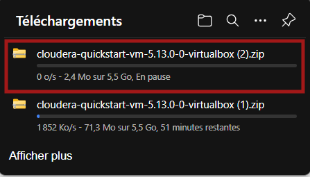 |
| Importation dans VirtualBox | 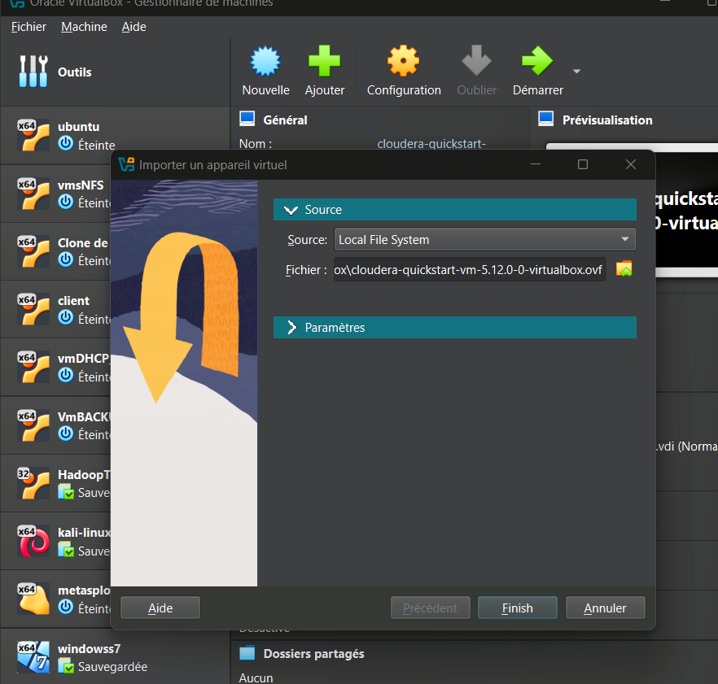 |
| Interface Cloudera | 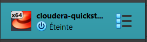 |
| Vérification de l'utilisateur connecté (`whoami`) | 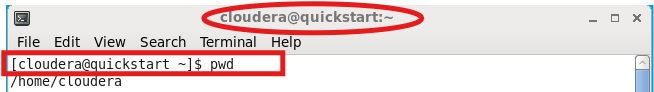 |

---

## 📨 Kafka — Ingestion en temps réel

**Rôle :** ingérer les données de ventes en temps réel via un système de topics (producer/consumer).

| Étape | Explication | Capture |
|---|---|---|
| 1. Vérification | Vérification que Kafka n'est pas déjà installé (`ls /usr/lib \| grep kafka`) | 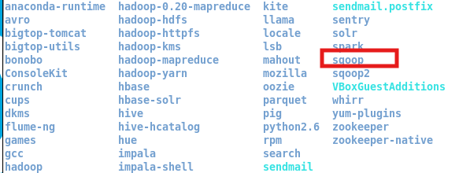 |
| 2. Installation | Téléchargement de Kafka 0.8.2.2 | 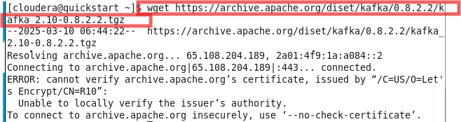 |
| 3. Résolution erreur SSL | Contournement de l'erreur de certificat SSL via le navigateur | 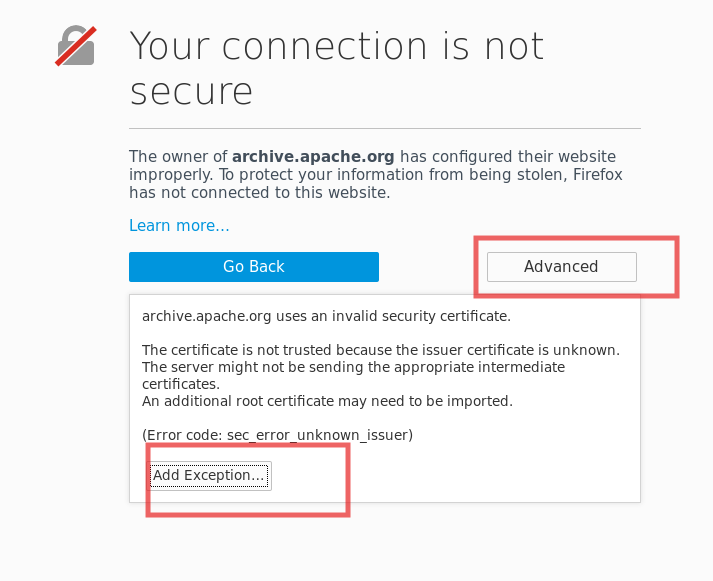 |
| 4. Exception de sécurité | Confirmation de l'exception de sécurité pour le téléchargement | 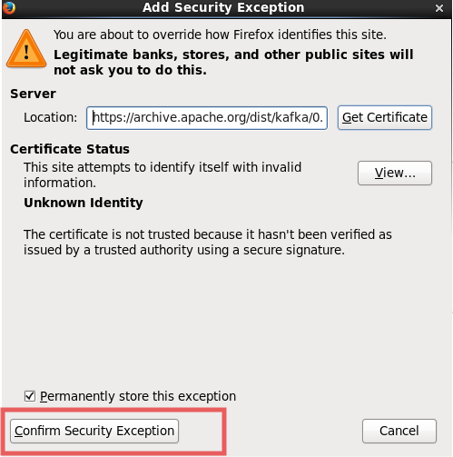 |
| 5. Vérification du téléchargement | Contrôle du fichier `.tgz` téléchargé | 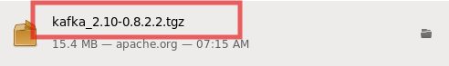 |
| 6. Extraction | Décompression de l'archive Kafka | 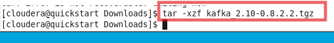 |
| 7. Démarrage Zookeeper | Zookeeper coordonne les métadonnées et les brokers Kafka | 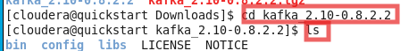 |
| 8. Commande Zookeeper | `bin/zookeeper-server-start.sh config/zookeeper.properties` | 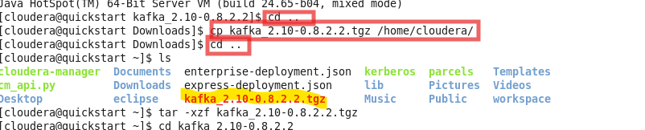 |
| 9. Cloudera Manager | Lancement du Cloudera Manager pour gérer les services | 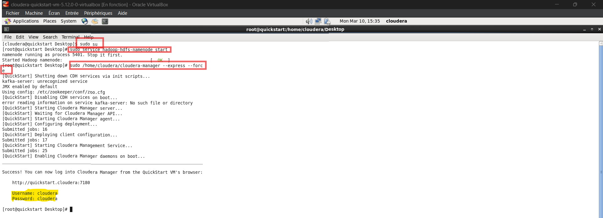 |
| 10. Connexion | Authentification (cloudera/cloudera) | 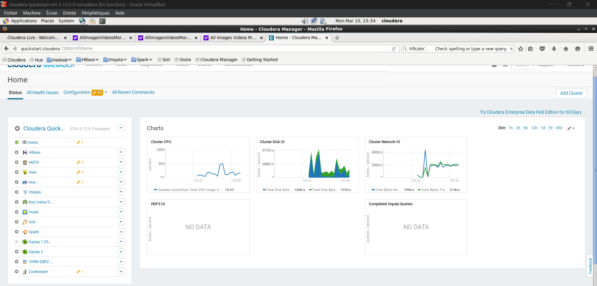 |
| 11. Démarrage Kafka | `bin/kafka-server-start.sh config/server.properties` | 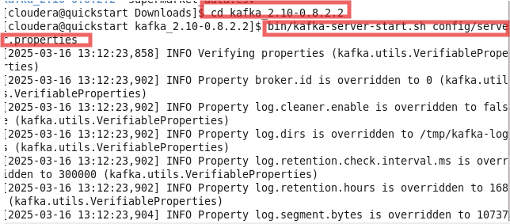 |
| 12. Création d'un topic | Création et listing du topic `my-topic` | 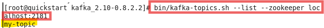 |
| 13. Producer | Envoi de messages (transactions) dans le topic | 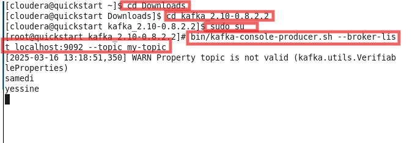 |
| 14. Consumer | Lecture des messages depuis le topic |  |
| 15. Test 1 | Vérification du flux producer → consumer | 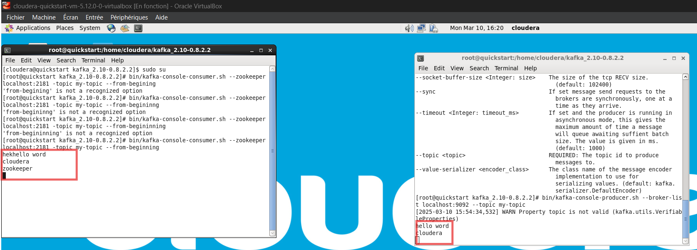 |
| 16. Test 2 | Test complémentaire du pipeline Kafka | 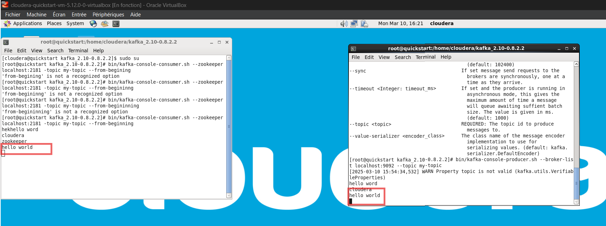 |

---

## 🔄 Sqoop — Transfert MySQL → HDFS

**Rôle :** transférer les données structurées depuis MySQL vers HDFS.

| Étape | Explication | Capture |
|---|---|---|
| 1. Vérification version | `sqoop version` (1.4.6-cdh5.12.0) | 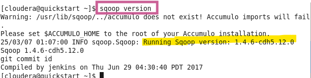 |
| 2. État HDFS | `hdfs dfsadmin -report` — vérifie NameNode, DataNodes, espace disponible | 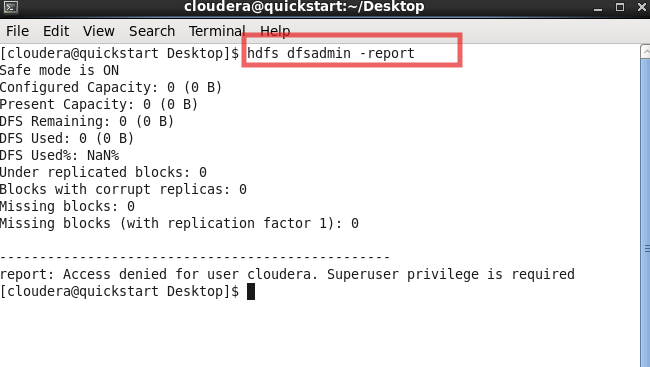 |
| 3. Désactivation Safe Mode | Sortie du mode sécurisé HDFS | 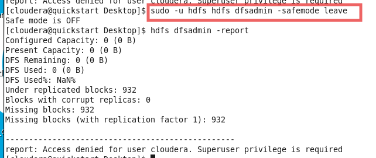 |
| 4. Nouveau test | Re-vérification de l'état HDFS après correction | 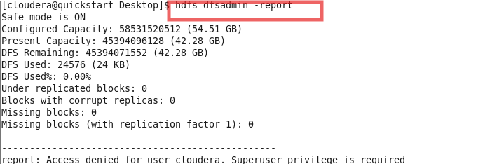 |
| 5. Import CSV → MySQL | Importation du fichier CSV dans la table `supermarket_data` | 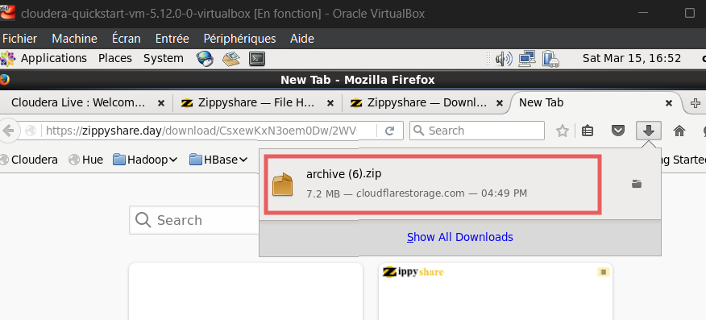 |
| 6. LOAD DATA | Requête SQL de chargement des données | 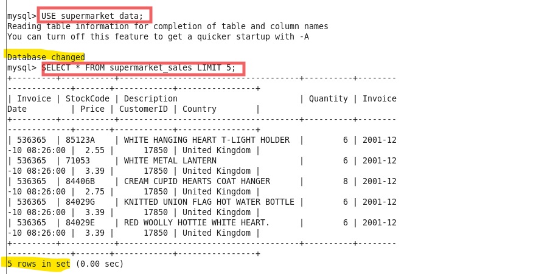 |
| 7. Démarrage NameNode | Service HDFS NameNode | 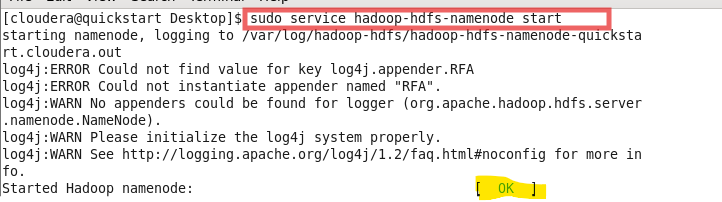 |
| 8. Démarrage DataNode | Service HDFS DataNode + YARN ResourceManager | 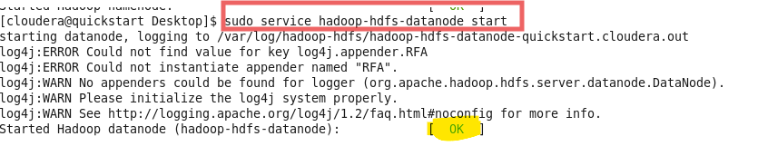 |
| 9. Services YARN | NodeManager + HistoryServer | 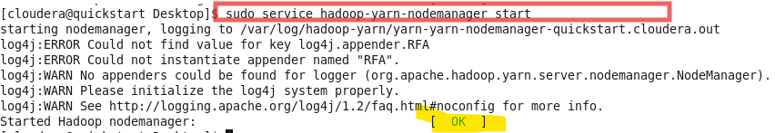 |
| 10. Vérification HDFS | Lecture des données importées dans HDFS | 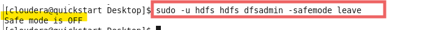 |
| 11. Import final | Exécution de la commande `sqoop import` (MySQL → HDFS) | 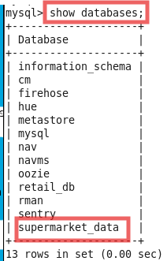 |

**Commande clé :**
```bash
sqoop import --connect jdbc:mysql://localhost/supermarket_data \
  --username root --password cloudera \
  --table supermarket_sales \
  --target-dir /user/root/supermarket_data \
  --m 1 --direct
```

---

## 🌊 Flume — Collecte de logs

**Rôle :** collecter et traiter des fichiers logs.

| Étape | Explication | Capture |
|---|---|---|
| 1. Vérification version | `flume-ng version` (1.6.0-cdh5.12.0) | 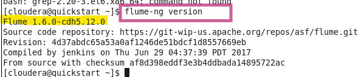 |
| 2. Téléchargement | Téléchargement de Flume 1.9.0 | 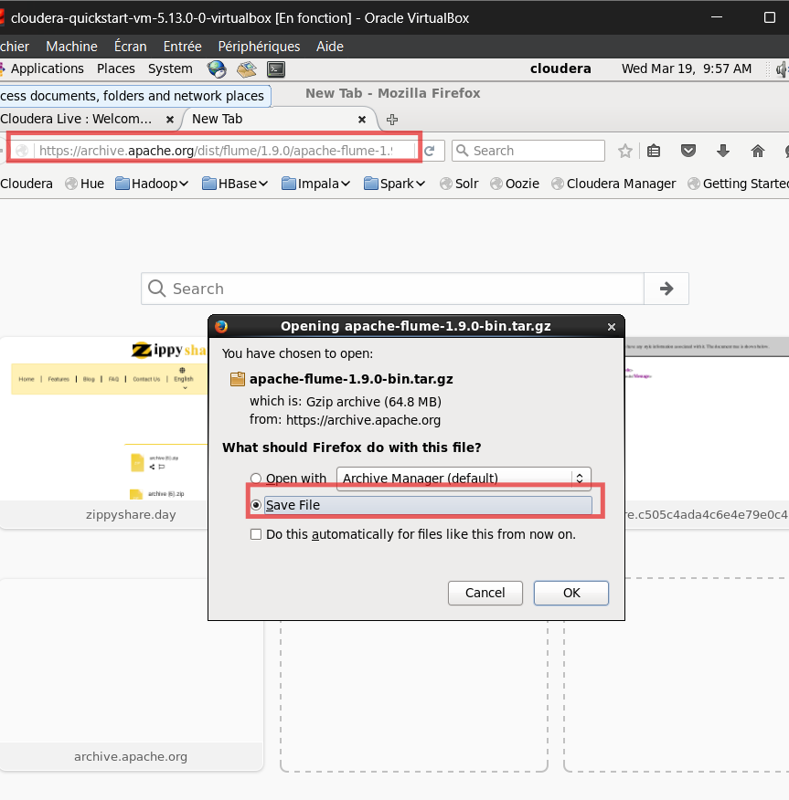 |
| 3. Extraction | Décompression de l'archive | 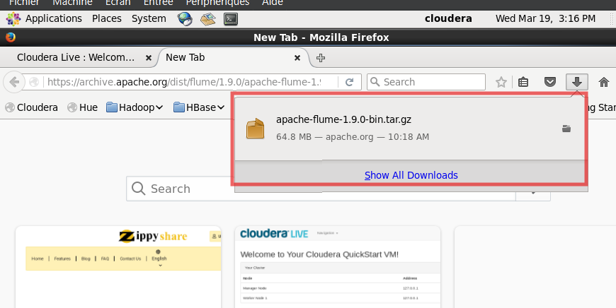 |
| 4. Conversion CSV → log | Script Python convertissant les données en fichier `.log` | 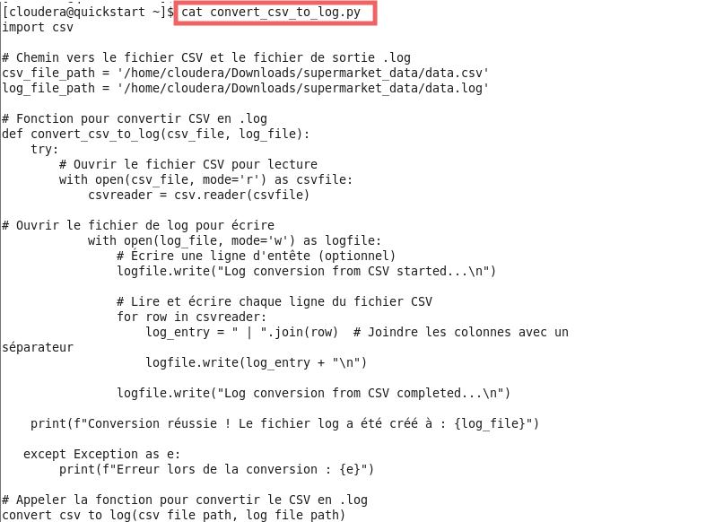 |
| 5. Configuration de l'agent | Définition source / channel / sink dans `flume.conf` | 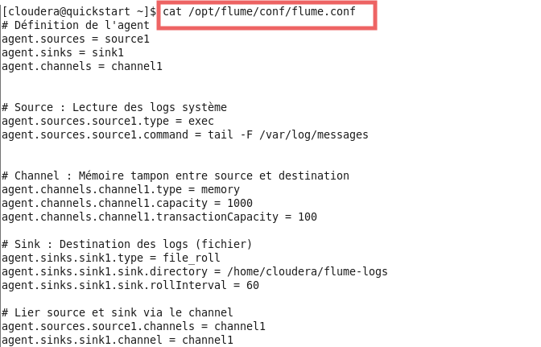 |

**Configuration de l'agent Flume :**
```properties
agent.sources = source1
agent.sinks = sink1
agent.channels = channel1

agent.sources.source1.type = exec
agent.sources.source1.command = tail -F /var/log/messages

agent.channels.channel1.type = memory
agent.channels.channel1.capacity = 1000
agent.channels.channel1.transactionCapacity = 100

agent.sinks.sink1.type = file_roll
agent.sinks.sink1.sink.directory = /home/cloudera/flume-logs
agent.sinks.sink1.sink.rollInterval = 60
```

---

## 🛠️ Stack technique

**Ingestion :** Kafka, Flume
**Transfert :** Sqoop
**Stockage :** HDFS (Hadoop)
**Base de données :** MySQL
**Environnement :** Cloudera QuickStart VM, VirtualBox

## 🎯 Conclusion

Ce projet démontre la mise en place d'une architecture Big Data complète pour la collecte et le stockage distribué de données de ventes — de l'ingestion en temps réel (Kafka) au transfert structuré (Sqoop) et à la collecte de logs (Flume), le tout centralisé dans HDFS pour un traitement ultérieur.
